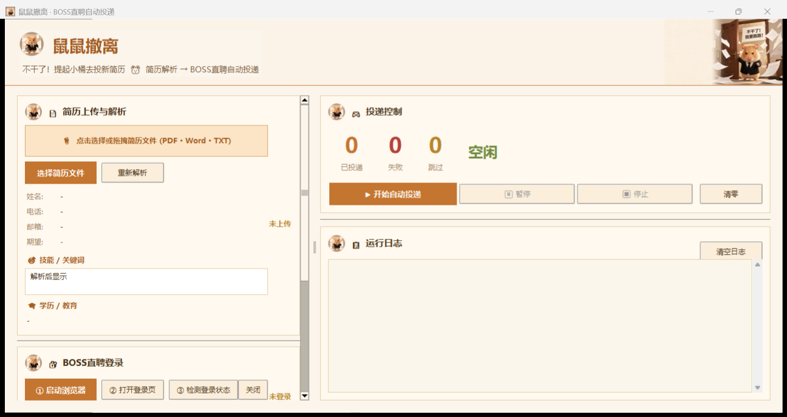
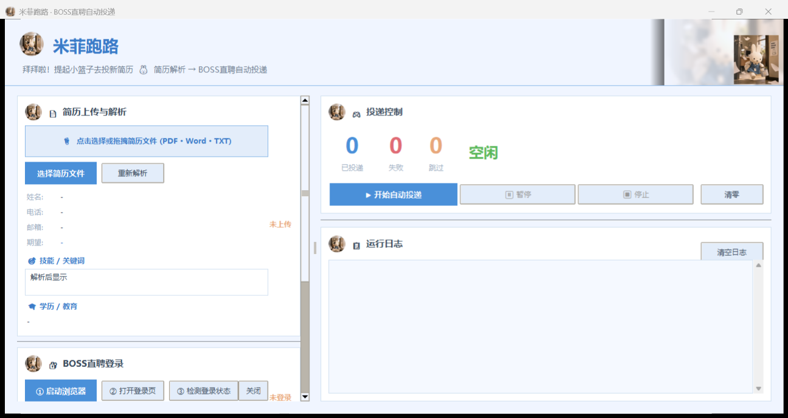

# FindJob

三个带不同主题界面的 BOSS 直聘求职辅助工具：

- `鼠鼠撤离`：暖色仓鼠主题
- `猫猫跑路`：粉色猫猫主题
- `米菲`：蓝白米菲主题

每个项目均包含本地简历解析、BOSS 登录页自动打开、岗位搜索与投递控制界面。三个项目采用同一套功能逻辑，仅界面主题和资源不同。

## 界面预览

以下均为程序实际运行时截取的界面。

### 鼠鼠撤离



### 猫猫跑路


### 米菲跑路



## 运行

需要 Windows、Python 3.10+ 和 Chrome。

```powershell
cd 鼠鼠撤离   # 也可以进入 猫猫跑路 或 米菲
pip install -r requirements.txt
python main.py
```

也可以双击项目内的 `run.bat`。需要生成单文件程序时，运行 `build.bat`；生成的 EXE 位于 `dist`，不会提交到仓库。

## 使用说明

1. 上传 PDF、Word 或 TXT 简历并解析。
2. 点击“启动浏览器”，程序会直接打开 BOSS 直聘登录页。
3. 在浏览器中使用自己的 BOSS 直聘账号扫码登录。
4. 填写搜索词、城市和投递数量后开始执行。

请只使用自己的账号，并遵守 BOSS 直聘及所在地区的适用规则。网站页面结构或规则变化时，浏览器自动化功能可能需要调整。

## 参与改进

欢迎任何人提交 Issue、Pull Request、界面改进、解析规则优化或兼容性修复。请不要加入虚构简历经历、技能或身份信息的功能。

如需交流或反馈，请联系：2230035325@qq.com

本项目以 MIT License 开源，欢迎在保留许可声明的前提下使用、修改和再发布。
